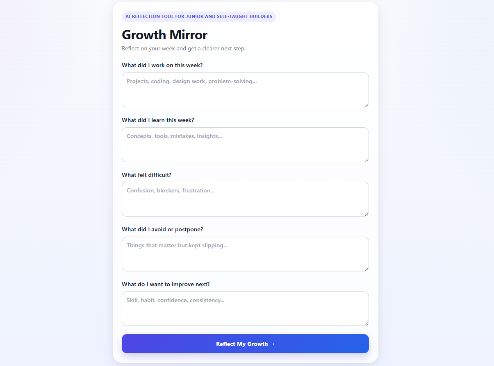

# Growth Mirror

Growth Mirror is a simple AI-inspired reflection tool designed for junior and self-taught builders.

It helps users reflect on their week and gain clarity on:

* where real progress happened
* what is slowing them down
* what to focus on next
* what practical step to take next

The goal is not to track more tasks — it is to reduce uncertainty and create momentum.

---

## The Problem

As a self-taught developer, one of the hardest challenges is not learning itself — it is knowing whether you are actually progressing.

When you work full-time, switch between multiple responsibilities, and learn mostly independently, progress often feels invisible.

You can be busy every day and still feel like you are standing still.

This is especially common for:

* junior developers
* self-taught builders
* career switchers
* people learning while working full-time

Urgent work often replaces important growth, and without reflection, it becomes difficult to see what is actually moving you forward.

---

## The Solution

Growth Mirror is a lightweight weekly reflection system.

Instead of functioning like a task manager, it acts as a clarity tool.

The user writes:

* What did I work on this week?
* What did I learn this week?
* What felt difficult?
* What did I avoid or postpone?
* What do I want to improve next?

The app then generates a structured reflection:

### Progress Spotted

Where real growth happened

### Biggest Gap

What is slowing progress down most

### Next Week Focus

The single highest-leverage focus

### Practical Next Step

One realistic action for momentum

---

## Why I Built It This Way

I deliberately kept the MVP narrow.

This is not a task manager, habit tracker, or productivity dashboard.

Tracking activity does not always mean meaningful growth.

I chose reflection over planning because the real problem is often not lack of effort — it is lack of clarity.

The goal was to help users answer one important question:

**“Am I actually moving forward?”**

---

## Product Thinking Behind the MVP

I intentionally avoided features like:

* dashboards
* streaks
* reminders
* course integrations
* calendar views
* complex progress tracking

because those often create more noise instead of better decisions.

I wanted the first version to validate one core product loop:

### reflection in → clarity out

before expanding into larger features.

This mirrors how I think about product building:
start small, solve one real problem well, then iterate.

---

## AI Logic

For this prototype, I intentionally mocked the intelligence layer first instead of integrating a live LLM API.

The system uses weighted keyword scoring to identify the dominant reflection pattern across three core areas:

* Focus & prioritization
* Technical growth
* Confidence & self-doubt

Instead of simple first-match logic, the app scores signals across all user inputs and returns the strongest reflection path.

This creates more realistic and personalized output while keeping the MVP lightweight and focused.

A live LLM integration through a server-side function would be the next step.

---

## Tech Stack

* React
* TypeScript
* Vite
* CSS
* Product logic through structured reflection scoring

---

## Screenshot



---

## Running Locally

```bash
npm install
npm run dev
```

---

## Future Improvements

Next iterations would include:

* live LLM integration through a secure server-side function
* saved weekly reflection history
* monthly progress comparison
* portfolio milestone tracking
* optional learning tracker for courses and skill development
* personalized growth patterns over time

The long-term vision is not just reflection, but helping junior builders build long-term career momentum with clarity.

---

## Why This Fits Bolt

Bolt’s Product Builder Programme focuses on people who can think across product, design, engineering, and AI-native workflows.

Growth Mirror reflects exactly that mindset:
identifying a real problem, keeping scope intentional, using AI as leverage, and building something simple that solves meaningful friction.

The goal was not to make something impressive.

The goal was to make something useful.
