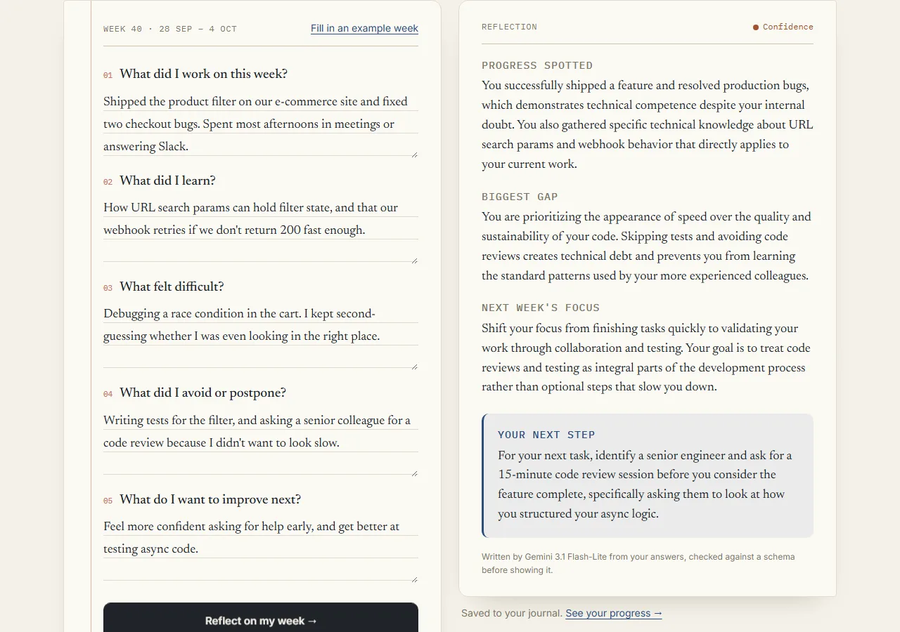
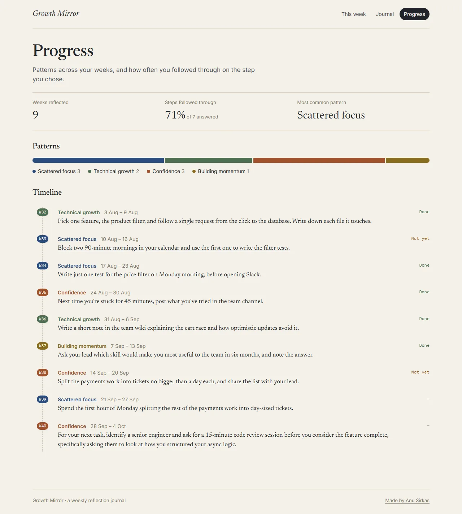
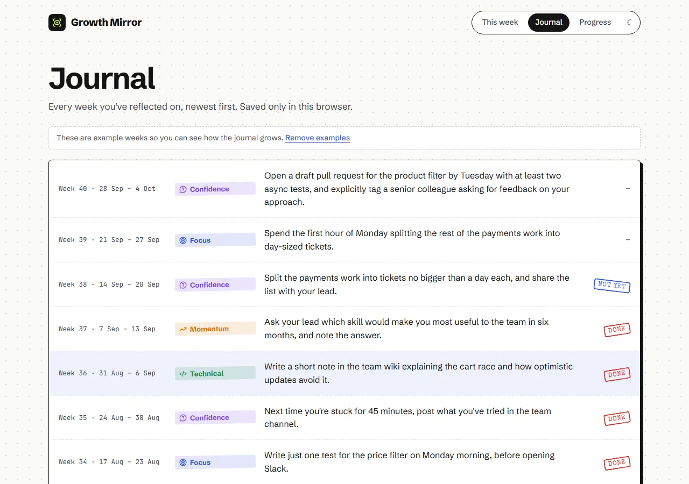

# Growth Mirror

[](https://github.com/anusirkas/growth-mirror/actions/workflows/ci.yml)

A weekly reflection journal for junior developers and people learning while they work. You answer five questions about your week; an AI reads them and gives back where you grew, what's slowing you down and **one concrete next step**. Next week it asks whether you took it, and over time the journal shows your patterns.

**Live:** https://growth-mirror.vercel.app · built by [Anu Sirkas](https://portfolio-anu-sirkas-projects.vercel.app)



| Progress | Journal |
|---|---|
|  |  |

## Why

When you work full-time and learn on the side, progress becomes invisible: busy every day, yet it feels like standing still. Growth Mirror is deliberately narrow. It isn't a task manager, habit tracker or dashboard of streaks. It's one loop:

**reflect → one step → did you take it? → reflect again**

The follow-through question is what turns advice into a habit, and it's the number the progress page leads with.

## Architecture

```
Browser (React + TypeScript, Vite)
  │  journal in localStorage (never sent anywhere)
  │
  └─ POST /api/reflect ──► Vercel Function (server/reflect.ts)
                             ├─ validate + trim input (5 answers, ≤1500 chars each)
                             ├─ per-IP rate limit (8 per 10 min, best effort per instance)
                             ├─ Gemini with a JSON schema, 15 s timeout
                             │     gemini-3.8-flash ──(429/503)──► gemini-3.1-flash-lite
                             ├─ validate the model's JSON before it reaches the user
                             └─ anything goes wrong ──► rule-based reflection (src/utils)
```

The Gemini key lives only in the function's environment; the browser never sees it. In development a small Vite plugin serves `/api/reflect` with the same handler, so the whole flow runs with `npm run dev`.

## Designing the AI part

- **Structured output, then validation.** The request carries a JSON Schema (theme enum plus four text fields), and the reply is still parsed and checked server-side: missing fields, unknown themes or suspiciously long text count as a failure.
- **It always answers.** No key, rate limit, timeout, API error or off-schema output all fall back to keyword scoring, and the UI says which one happened ("Rule-based reflection: the AI took too long…"), so the result is never silently worse.
- **Two models.** The free tier returns 503 at busy times, so a lighter model is tried before falling back.
- **Thinking budget.** Gemini 3 models reason before answering and those tokens count towards the output limit. With the default level the first replies were cut off mid-JSON (`finishReason: MAX_TOKENS` after ~760 thinking tokens); a low thinking level and a 2 048-token cap fixed it.
- **Prompt.** The system prompt asks for specific, non-coaching language tied to what the user wrote, in the user's language. Answers are fenced as data and the prompt says to ignore instructions inside them. See `server/prompt.ts`.
- **Privacy.** Reflections aren't stored on the server. The page says plainly that answers go to Google and that free-tier requests may be used to improve Google's models.

## The journal

Entries live in `localStorage` behind a small store read with `useSyncExternalStore` (synced across tabs). One entry per ISO week (`src/lib/journal.ts`); the latest reflection in a week wins. The progress page derives everything from the entries: follow-through rate over answered weeks, pattern mix and a timeline. A first visit gets eight example weeks of a fictional junior developer, flagged and removable, so the journal and progress views aren't empty.

## Project structure

```
api/reflect.ts            Vercel Function entry
server/
  reflect.ts              request handling, rate limit, timeout, fallback
  gemini.ts               model calls with backup model
  prompt.ts               system prompt, user prompt, JSON schema
src/
  lib/validate.ts         input validation and model-output parsing (shared)
  lib/journal.ts          entries, ISO weeks, stats, storage
  utils/generateReflection.ts   rule-based fallback
  pages/                  This week, Journal, Progress
  components/             form, reflection, follow-through, header
e2e/                      Playwright tests
```

## Tests

```bash
npm test           # 18 unit tests (Vitest)
npm run test:e2e   # 16 end-to-end tests (Playwright, desktop and mobile)
```

Unit tests cover input validation, parsing model output, the fallback scorer, ISO weeks and journal stats, and the request handler in every branch: success, bad input, no key, model error, off-schema output, timeout (fake timers) and rate limiting. The model is injected, so tests never call Gemini.

End-to-end tests run the dev server with the key blanked and stub the API in the browser where needed: AI and fallback results, an unreachable API, server validation errors, the example journal, follow-through updating the progress rate, and deleting a week from the timeline.

CI runs lint, type-checking, unit tests and a production build, then the end-to-end suite, on every push.

## Run locally

```bash
npm install
npm run dev
```

Without a key every reflection is rule-based. To use Gemini, create a free key at [Google AI Studio](https://aistudio.google.com) and add it to `.env.local`:

```bash
GEMINI_API_KEY=...
```

## Trade-offs

- **Journal per browser.** No accounts, so a journal doesn't follow you between devices. Storing reflections server-side would need auth and a clear privacy story.
- **Best-effort rate limiting.** The in-memory limit resets when a serverless instance is recycled; a shared store (e.g. Redis) would make it exact.
- **One reflection per week.** Rewriting a week replaces the earlier reflection in the journal rather than keeping both.

## Screenshots

Generated with `npx tsx scripts/screenshots.ts` against a running dev server.
